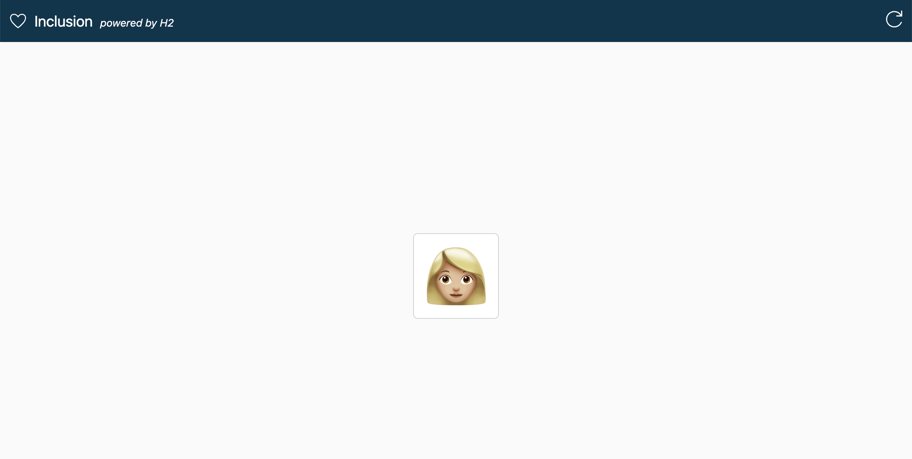
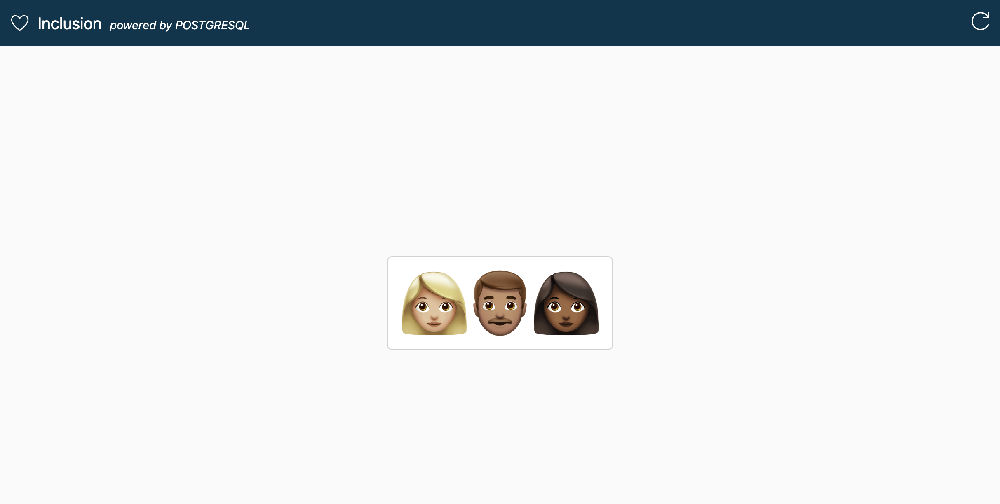

# Emoji Inclusion

Emoji Inclusion is a simple Spring Boot application that can be used to demonstrate the behavior of an in-memory vs a persistence database with multiple stateless application instances.
It especially works well with ServiceBindings for [Kubernetes](https://servicebinding.io) or [CloudFoundry](https://docs.cloudfoundry.org/devguide/services/application-binding.html).

If you refresh the page with the default in-memory database and multiple running instances, you will see that the emoji is changing, as every instance has its own state.

When an external database is configured, you should see multiple emojis that remain consistent, as all instances share the same state.
